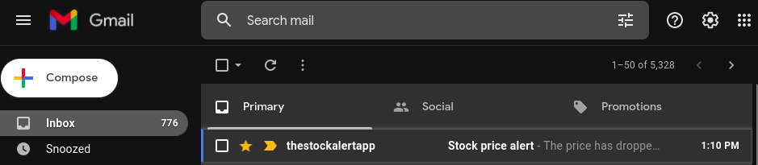
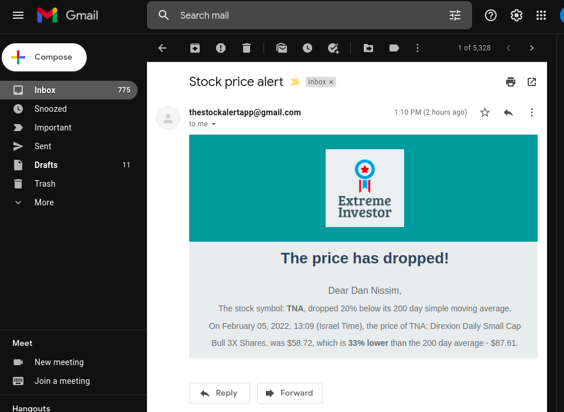

<!-- PROJECT SHIELDS -->
<!--
*** I'm using markdown "reference style" links for readability.
*** Reference links are enclosed in brackets [ ] instead of parentheses ( ).
*** See the bottom of this document for the declaration of the reference variables
*** for contributors-url, forks-url, etc. This is an optional, concise syntax you may use.
*** https://www.markdownguide.org/basic-syntax/#reference-style-links
-->
[![Contributors][contributors-shield]][contributors-url]
[![Forks][forks-shield]][forks-url]
[![Stargazers][stars-shield]][stars-url]
[![Issues][issues-shield]][issues-url]
[![MIT License][license-shield]][license-url]
[![LinkedIn][linkedin-shield]][linkedin-url]

<!-- PROJECT LOGO -->
 

  

<h3 align="center">Stock Alert</h3>
  Get alerts when a stock price drops.
  

     
    <a href="https://github.com/dannissim/stock-alert/issues">Report Bug</a>
    ·
    <a href="https://github.com/dannissim/stock-alert/issues">Request Feature</a>
  

<!-- ABOUT THE PROJECT -->
## About The Project
The existing stock price notification apps aren't feature filled enough to fit some of my needs.  
For example, Yahoo Finance's app only notifies you once a stock has reached a *fixed* price,  
and doesn't let you receive a notification when the stock price dropped relative to past prices.  
So, I built this app with some extra features.

(<a href="#top">back to top</a>)

### Built With

* [Python 3.8](https://python.org/)
* [Financial Modeling Prep's free API](https://site.financialmodelingprep.com/)
* [Free HTML Email Templates](https://unlayer.com/templates)
* [Jinja2](https://jinja.palletsprojects.com/en/3.0.x/)
* [PythonAnywhere](https://www.pythonanywhere.com/)

(<a href="#top">back to top</a>)

## Usage

1. Add your stock list and contact info to `config.json`.
2. Create a virtual environment (optional):  
    a. `python -m venv venv`  
    b. `venv\Scripts\activate` or in linux `source venv/bin/activate`
2. install the requirements: `pip install -r requirements.txt`
2. Run `python main.py`

### What does it do?
This app checks your list of stocks to see if a price has dropped significatly lower  
than its 200 day simple moving average a.k.a [SMA](https://www.investopedia.com/terms/s/sma.asp).  
When a stock price passes the threshold, you will receive an email that will notify you.

### Deployment
* I've personally deployed this app with PythonAnywhere, which lets me run this as a daily task for free with a quick setup.

<!-- CONTRIBUTING -->
## Contributing

Contributions are what make the open source community such an amazing place to learn, inspire, and create. Any contributions you make are **greatly appreciated**.

If you have a suggestion that would make this better, please fork the repo and create a pull request. You can also simply open an issue with the tag "enhancement".
Don't forget to give the project a star! Thanks again!

1. Fork the Project
2. Create your Feature Branch (`git checkout -b feature/AmazingFeature`)
3. Commit your Changes (`git commit -m 'Add some AmazingFeature'`)
4. Push to the Branch (`git push origin feature/AmazingFeature`)
5. Open a Pull Request

(<a href="#top">back to top</a>)

<!-- LICENSE -->
## License

Distributed under the MIT License. See `LICENSE` for more information.

(<a href="#top">back to top</a>)

<!-- MARKDOWN LINKS & IMAGES -->
<!-- https://www.markdownguide.org/basic-syntax/#reference-style-links -->
[contributors-shield]: https://img.shields.io/github/contributors/dannissim/stock-alert.svg?style=for-the-badge
[contributors-url]: https://github.com/dannissim/stock-alert/graphs/contributors
[forks-shield]: https://img.shields.io/github/forks/dannissim/stock-alert.svg?style=for-the-badge
[forks-url]: https://github.com/dannissim/stock-alert/network/members
[stars-shield]: https://img.shields.io/github/stars/dannissim/stock-alert.svg?style=for-the-badge
[stars-url]: https://github.com/dannissim/stock-alert/stargazers
[issues-shield]: https://img.shields.io/github/issues/dannissim/stock-alert.svg?style=for-the-badge
[issues-url]: https://github.com/dannissim/stock-alert/issues
[license-shield]: https://img.shields.io/github/license/dannissim/stock-alert.svg?style=for-the-badge
[license-url]: https://github.com/dannissim/stock-alert/blob/master/LICENSE.txt
[linkedin-shield]: https://img.shields.io/badge/-LinkedIn-black.svg?style=for-the-badge&logo=linkedin&colorB=555
[linkedin-url]: https://linkedin.com/in/dan-nissim-2558a785
[product-screenshot]: images/screenshot.png
